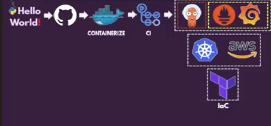
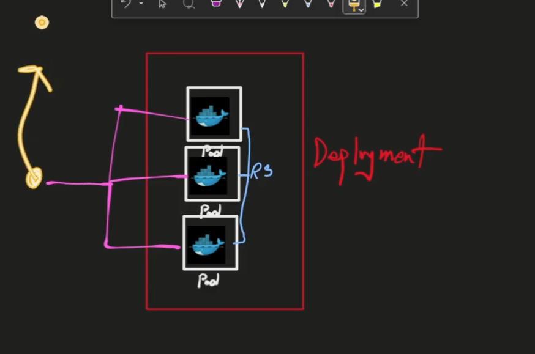

# hello-end-to-end

* Flow of Project

* Required Tools
  > 1. Install Docker 
  > 2. Install git
  > 3. Install python
  > 4. Install pip
  > 5. Install aws cli
  > 6. Install terraform 
  > 7. Install kubectl
  > 8. Install helm
  > 9. Install eksctl

1. create a app.py file and paste the content
-------------------------------------

from flask import Flask
#from prometheus_flask_exporter import PrometheusMetrics
app = Flask(__name__)
#metrics = PrometheusMetrics(app)   # <-- enables /metrics
@app.route("/")
def hello():
    return "Hello World!"                   
@app.route("/new")
def new():
    return "FINAL CHECK"            
if __name__ == "__main__":
    app.run(host="0.0.0.0", port=5000)

-------------------------------------------------------------------------------------
2. run the python app.py if there is showing error that means there flask is not installed. So run:

  > pip intall flask
  > python app.py 

3. To create a requirements.txt file and paste the content
--------------------------------

Flask

4. To create a dockerfile 
--------------------------------

FROM python:3.12-slim

WORKDIR /app

COPY requirements.txt   .
COPY app.py   .

RUN pip install --no-cache-dir -r requirements.txt

EXPOSE 5000

CMD ["python", "app.py"]

5. To run the container via created docker file
--------------------------------

> docker build -t hello .
> docker run -d -p 5000:5000 --name hellocontainer hello:latest
> curl http://localhost:5000

6. Push the docker image to the dockerhub
--------------------------------

create a dockerhub acount if you already have that's fine
- How to create a dockerhub acount
> Go to https://hub.docker.com/ and sign up for an account
> After the creating account go to terminal and run "docker login" command and link and otp is showing copy the otp and click on link and paste otp and login successfully

> docker tag hello:latest <your-dockerhub-username>/hello:latest
> docker push <your-dockerhub-username>/hello:latest

7. Create a jenkins file
------------------------

> Go to manage jenkis section and clink on configure system and find the global credentials and enter the dockerhub username and password and store them and then go to the new item and select pipeline and create.

> In the pipeline section select git and enter the repository url and click on save and then go to the new item and select pipeline and create.

> Go to github and create a jekinsfile and paste the content

------------------------------------
For linux sh and for windows bat

pipeline {
    agent any

    environment {
        image_name = "devoopsguru/hello"
    }

    stages {
        stage("git-checkout") {
            steps {
                checkout scm
            }
        }
        stage("image-build") {
            steps {
                script {
                    env.image_tag = new Date().format("yyyy-MM-dd-HHmmss")
                    env.full_image = "${env.image_name}:${env.image_tag}"
                }
            }
        }
        stage("docker login") {
            steps {
                script {
                    withCredentials([usernamePassword(credentialsId: 'docker_cred', usernameVariable: 'DOCKER_USERNAME', passwordVariable: 'DOCKER_PASSWORD')]) {
                        sh "docker login -u ${DOCKER_USERNAME} -p ${DOCKER_PASSWORD}"
                    }
                }
            }
        }
        stage("docker push") {
            steps {
                script {
                    sh "docker build -t ${env.full_image} ."
                    sh "docker push ${env.full_image}"
                }
            }
        }
    }
}

8. Now we are creating a kubernetes cluster with terraform
--------------------------------------------

* First we need to configure aws credentials with terraform or terimal 

Need to download: 
- [ ] AWS Cli
- [ ] Terraform
- [ ] Kubectl
- [ ] Helm
- [ ] EKSCTL

A. Create a IAM role with the policy 

Managed Policy                           Purpose
AmazonEKSClusterPolicy                   EKS cluster operations
AmazonEKSWorkerNodePolicyNode            group permissions
AmazonEKS_CNI_Policy                     VPC CNI add-on
AmazonEC2ContainerRegistryReadOnly       Pull images from ECR 
AmazonVPCFullAccess                      VPC/subnet/NAT/IGW
IAMFullAccessRole                        creation for EKS (scope down in prod)

A. Configure aws credentials 

    > aws configure 

B. Create a terraform file for kubernetes cluster

----------------------------------------------------------------
terraform {
  required_version = ">= 1.3.0"
  required_providers {
    aws = {
      source  = "hashicorp/aws"
      version = "~> 6.0"
    }
  }
}

provider "aws" {
  region = "us-east-1"
}

# VPC module
module "vpc" {
  source  = "terraform-aws-modules/vpc/aws"
  version = "~> 5.8"

  name            = "my-vpc"
  cidr            = "10.0.0.0/16"
  azs             = ["us-east-1a", "us-east-1b", "us-east-1c"]
  public_subnets  = ["10.0.101.0/24", "10.0.102.0/24", "10.0.103.0/24"]
  private_subnets = ["10.0.1.0/24", "10.0.2.0/24", "10.0.3.0/24"]

  enable_nat_gateway = true
  single_nat_gateway = true

  tags = {
    Terraform   = "true"
    Environment = "dev"
  }

  public_subnet_tags = {
    "kubernetes.io/role/elb" = "1"
  }

  private_subnet_tags = {
    "kubernetes.io/role/internal-elb" = "1"
  }
}

# EKS Cluster module
module "eks" {
  source  = "terraform-aws-modules/eks/aws"
  version = "~> 21.0"

  name               = "my-cluster"        # was: cluster_name
  kubernetes_version = "1.30"              # was: cluster_version

  addons = {                               # was: cluster_addons
    coredns                = { most_recent = true }
    kube-proxy             = { most_recent = true }
    vpc-cni                = { most_recent = true }
    eks-pod-identity-agent = { most_recent = true }
  }

  endpoint_public_access                   = true   # was: cluster_endpoint_public_access
  enable_cluster_creator_admin_permissions = true

  vpc_id     = module.vpc.vpc_id
  subnet_ids = module.vpc.private_subnets

  eks_managed_node_groups = {
    default = {
      instance_types = ["t3.micro"]
      min_size       = 1
      max_size       = 3
      desired_size   = 2
    }
  }

  tags = {
    Environment = "dev"
    Terraform   = "true"
  }
}
  
------------------------------------------------------------------

> terraform init
> terraform plan
> terraform apply
> rm -rf .terraform .terraform.lock.hcl     # delete the terraform lock files and then
  > terraform init
  > terraform plan

> terraform apply -auto-approve 

Once apply finishes, connect to your cluster:

> aws eks --region us-east-1 update-kubeconfig --name my-cluster

> kubectl get nodes

** Note = if you create a any loadbalance please change into cluster ip and then apply the terraform destroy Why because terraform try to destroy but not successful in deleting lb because some dependecy on lb and it convert into infinite loop **

> how to create and access of the cluster with CLI command

# Create access entry
aws eks create-access-entry \
    --cluster-name my-cluster \
    --principal-arn arn:aws:iam::701201543425:user/eks \
    --type STANDARD \
    --username eks \
    --region us-east-1

# Attach admin policy
aws eks associate-access-policy \
    --cluster-name my-cluster \
    --principal-arn arn:aws:iam::701201543425:user/eks \
    --policy-arn arn:aws:eks::aws:cluster-access-policy/AmazonEKSClusterAdminPolicy \
    --access-scope type=cluster \
    --region us-east-1

# Connect kubectl
aws eks update-kubeconfig --region us-east-1 --name my-cluster

# Verify
kubectl get nodes

9. Now we are creating a kubernetes deployment and service
--------------------------------------------
create the deployment yaml file
---------------------------------
apiVersion: apps/v1
kind: Deployment
metadata:
  name: hello-deployment
  namespace: default   # if you create a namespace please use that namespace here
  labels:
    app: hello    # this lable is very important please use this label in service yaml file
spec:
  replicas: 2
  selector:
    matchLabels:
      app: hello
  template:
    metadata:
      labels:
        app: hello
    spec:
      containers:
      - name: hello-flask-app
        image: devoopsguru/hello:2026-05-15-132410
        ports:
        - containerPort: 5000

---

## create the service yaml file

apiVersion: v1
kind: Service
metadata:
  name: hello-service
  namespace: default   # if you create a namespace please use that namespace here
  labels:
    app: hello    # this lable is very important please use this label in service yaml file 
    release: prometheus
spec:
  selector:
    app: hello
  ports:
  - name: http
    protocol: TCP
    port: 80
    targetPort: 5000
  type: ClusterIP

--------------------------------------------------------

> kubectl apply -f deployment.yaml
> kubectl apply -f service.yaml

> kubectl get all -n default or kubectl get all

> kubectl port-forward service/hello-service 8080:80

10. Monitoring tools ( prometheus and grafana)
----------------------------------------

we are installing the prometheus via the helm :

> helm version

> helm repo add prometheus-community https://prometheus-community.github.io/helm-charts
> helm repo update
> helm install prometheus prometheus-community/kube-prometheus-stack -n monitoring --create-namespace 

Now modify the requirement.txt file

add the content :

prometheus-client==0.21.0
prometheus-flask-exporter==0.23.1

Now modify the app.py file 

from flask_prometheus_exporter import PrometheusMetrics

metrics = PrometheusMetrics(app) # enble/metrics

or whole file like :

--------------------------------------------
from flask import Flask
from prometheus_flask_exporter import PrometheusMetrics

app = Flask(__name__)
metrics = PrometheusMetrics(app)   # <-- enables /metrics

@app.route("/")
def hello():
    return "Hello World!"                   

@app.route("/new")
def new():
    return "FINAL CHECK"            

if __name__ == "__main__":
    app.run(host="0.0.0.0", port=5000)

-----------------------------------------------------------

http://[IP_ADDRESS]/metrics --> prometheus 

11. define the prometheus configmap 

here we have a two option 
A. via edit prometheus.yaml file 
B. via servicemonitor.yaml file

we are using option B because it is the best practice.

create the servicemonitor.yaml file
-------------------------------------------------

apiVersion: monitoring.coreos.com/v1
kind: ServiceMonitor
metadata:
  name: hello-service
  namespace: monitoring
  labels:
    release: prometheus
spec:
  selector:
    matchLabels:
      app: hello
  namespaceSelector:
    matchNames:
      - default 
  endpoints:
  - port: http
    path: /metrics
    interval: 15s

-------------------------------------------------

> kubectl apply -f servicemonitor.yaml

----------------------------------------
